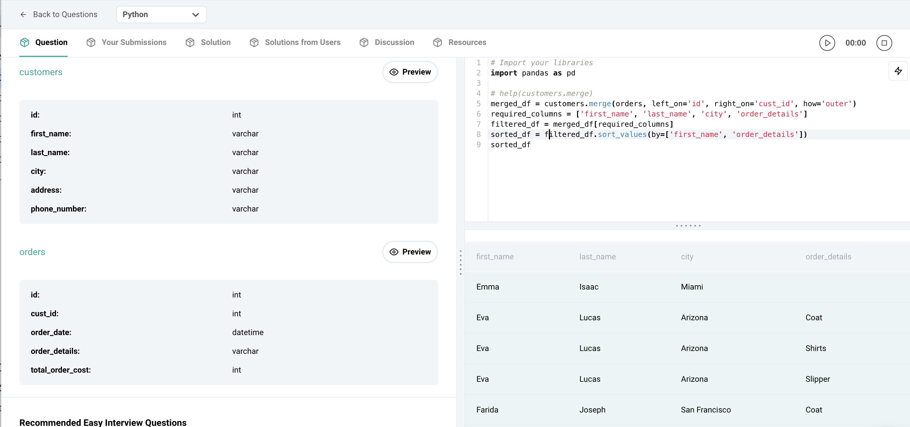

## Finding All Customers with Order Details (Inner Join)

This solution retrieves information about all customers, including those who haven't placed any orders, and their corresponding order details (if available). The output is sorted by the customer's first name and then by order details (ascending order).

**Step 1: Merging DataFrames (Outer Join)**

- We use `customers.merge(orders, left_on='id', right_on='cust_id', how='outer')` to merge the `customers` and `orders` DataFrames.
  - `left_on='id'` specifies the column in the 'customers' DataFrame used for the merge (left table).
  - `right_on='cust_id'` specifies the column in the 'orders' DataFrame used for the merge (right table).
  - `how='outer'` ensures all rows from the 'customers' DataFrame are included in the result, even if there's no match in the 'orders' DataFrame (for customers without orders).

```python
merged_df = customers.merge(orders, left_on='id', right_on='cust_id', how='outer')
```

**Explanation:**

This step creates a new DataFrame (`merged_df`) that combines data from both 'customers' and 'orders' DataFrames based on the customer ID ('id' in 'customers' and 'cust_id' in 'orders'). Customers with no matching orders will have 'NaN' values in the 'order_details' column.

**Step 2: Selecting Required Columns**

- We use `required_columns = ['first_name', 'last_name', 'city', 'order_details']` to define a list of columns we want to keep from the merged DataFrame.
- We then filter `merged_df` using this list to get a DataFrame (`filtered_df`) containing only the specified columns.

```python
required_columns = ['first_name', 'last_name', 'city', 'order_details']
filtered_df = merged_df[required_columns]
```

**Explanation:**

This step selects the desired columns (customer name, city, and order details) from the merged DataFrame, resulting in a cleaner and more focused output.

**Step 3: Sorting the DataFrame**

- We use `sort_values(by=['first_name', 'order_details'])` to sort the filtered DataFrame (`filtered_df`) by two criteria:
  - First by the 'first_name' column (ascending order).
  - Then within each first name group, by the 'order_details' column (ascending order). 'NaN' values (representing no orders) will be sorted first within each first name group.

```python
sorted_df = filtered_df.sort_values(by=['first_name', 'order_details'])
```

**Explanation:**

This step organizes the data first by customer first name (alphabetical order) and then, for each customer, by their order details (if any, with 'NaN' appearing first).

**Sample Output:**

| first_name | last_name | city          | order_details                 |
|---|---|---|---|
| Alice      | Smith     | New York      | Household items              |
| Bob        | Johnson   | Los Angeles  | Electronics                 |
| Charlie    | Williams  | Chicago       | Furniture                    |
| David      | Miller    | Austin        | NaN                          | (no order)
| Emily      | Brown     | Houston       | Kitchen appliances           |

**Explanation:**

The output shows customer details (first name, last name, and city) along with their corresponding order details. Customers without orders have 'NaN' in the 'order_details' column. The data is sorted first by customer name and then by order details (with 'NaN' preceding any actual order details).

